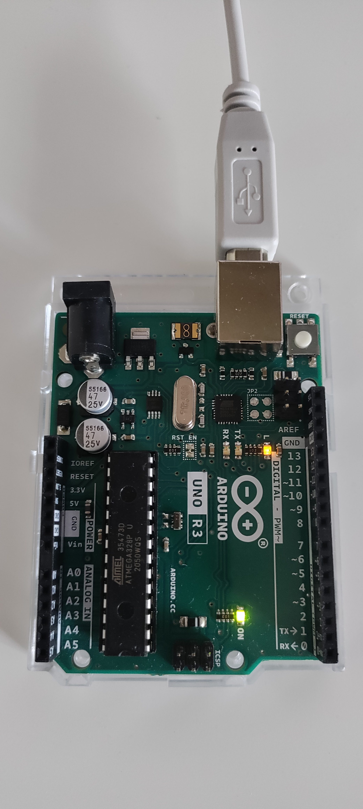

# Arduino Serial Communication Test with Pytest

This project demonstrates how to automate testing of an Arduino Uno using Python and `pytest` over a serial connection.

The Arduino Uno used for testing is shown below.

<p align="center">
  
</p>


The Arduino firmware listens for serial commands and responds with status messages. Python tests communicate with the board and verify the responses.

---

## Project Structure

```text
arduino-test/
│
├── src/
│   └── arduino.py           # Arduino serial communication wrapper
│
├── tests/
│   ├── conftest.py          # Pytest fixtures
│   └── test_arduino_serial.py
│
├── requirements.txt
├── pytest.ini
└── README.md
```

---

## Requirements

### Hardware

- Arduino Uno
- USB cable

### Software

- Python 3.10+
- Arduino IDE
- pip

---

## Install Python Dependencies

Create and activate a virtual environment (recommended):

### Windows

```bash
python -m venv .venv
.venv\Scripts\activate
```

### Linux/macOS

```bash
python3 -m venv .venv
source .venv/bin/activate
```

Install the required packages:

```bash
pip install -r requirements.txt
```

Example `requirements.txt`

```text
pytest
pyserial
```

---

## Arduino Sketch

Upload the following sketch to the Arduino Uno.

```cpp
int ledToggleTime = 100;

void setup() {
  Serial.begin(9600);
  delay(2000);

  Serial.println("READY");
  Serial.println("IDLE");
}

void loop() {

  if (Serial.available()) {
    char cmd = Serial.read();

    if (cmd == '1') {
      ledToggleTime = 100;
      Serial.println("OK: 100");
    }

    else if (cmd == '2') {
      ledToggleTime = 500;
      Serial.println("OK: 500");
    }

    else if (cmd == 't') {
      Serial.println("Arduino is alive!");
    }

    else if (cmd == 's') {
      Serial.print("Blink=");
      Serial.println(ledToggleTime);
    }
  }

  digitalWrite(LED_BUILTIN, HIGH);
  delay(ledToggleTime);
  digitalWrite(LED_BUILTIN, LOW);
  delay(ledToggleTime);
}
```

---

## Supported Serial Commands

| Command | Description | Expected Response |
|----------|-------------|-------------------|
| `t` | Ping Arduino | `Arduino is alive!` |
| `1` | Set blink interval to 100 ms | `OK: 100` |
| `2` | Set blink interval to 500 ms | `OK: 500` |
| `s` | Read current blink interval | `Blink=100` or `Blink=500` |

---

## Python Tests

The project contains four automated tests.

### Ping Test

Checks that the Arduino is responding.

```python
response = board.query("t")
assert response == "Arduino is alive!"
```

---

### Blink 100 Test

Sets the LED blink interval to 100 ms.

```python
response = board.query("1")
assert response == "OK: 100"
```

---

### Blink 500 Test

Sets the LED blink interval to 500 ms.

```python
response = board.query("2")
assert response == "OK: 500"
```

---

### Status Test

Changes the blink interval and verifies the reported value.

```python
board.query("2")
response = board.query("s")
assert "500" in response
```

---

## Configure Serial Port

Update the serial port in your Python code or configuration.

Examples:

### Windows

```text
COM3
COM4
COM5
```

### Linux

```text
/dev/ttyACM0
/dev/ttyUSB0
```

### macOS

```text
/dev/cu.usbmodemXXXX
```

---

## Running the Tests

Run all tests:

```bash
pytest
```

Run with verbose output:

```bash
pytest -v
```

Run a single test:

```bash
pytest tests/test_arduino_serial.py::test_ping
```

---

## Expected Output

```text
==================== test session starts ====================

tests/test_arduino_serial.py::test_ping PASSED
tests/test_arduino_serial.py::test_blink_100 PASSED
tests/test_arduino_serial.py::test_blink_500 PASSED
tests/test_arduino_serial.py::test_status PASSED

===================== 4 passed =====================
```

---

## How It Works

1. Python opens a serial connection to the Arduino.
2. A command is sent over USB.
3. The Arduino processes the command.
4. The Arduino returns a response.
5. The Python test validates the response using assertions.

---

## Future Improvements

- Support configurable serial ports via command-line arguments.
- Add timeout and error handling tests.
- Test invalid commands.
- Add GitHub Actions workflow with hardware-in-the-loop testing.
- Support multiple Arduino boards.

---

## License

This project is provided for educational and testing purposes.